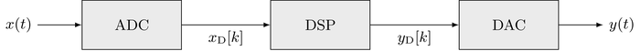

# Digital Signal Processing

This repository contains a collection of [Jupyter](https://jupyter.org/) notebooks discussing various topics of [Digital Signal Processing](https://en.wikipedia.org/wiki/Digital_signal_processing). The notebooks provide an introduction into the foundations of spectral analysis, random signals, quantization and filtering. A basic understanding of discrete signals and systems is assumed. See [index.ipynb](index.ipynb) for an overview on the available topics. The theory is accompanied by computational examples written in [IPython 3](http://ipython.org/). These examples are best explored in an interactive manner.

## Getting Started

The Jupyter notebooks are available

* Online as [static web pages]((http://nbviewer.ipython.org/github/lev1khachatryan/Digital_Signal_Processing/blob/master/DSP-Lectures/index.ipynb))

* Local (offline) use on your computer

The local use on your computer requires a local Jupyter/IPython installation. The [Anaconda distribtution](https://www.continuum.io/downloads) provides a good starting point. 